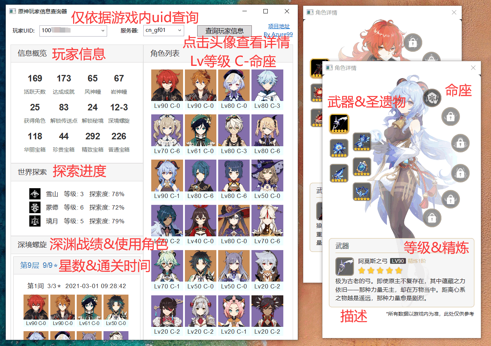

# 原神玩家信息查询器
仅使用游戏内**uid** (而**非米游社账号**) 查询玩家详情, 包括玩家信息, 角色详情, 深渊战绩等数据

[立即下载](https://github.com/Azure99/GenshinPlayerQuery/releases) [问题反馈](https://github.com/Azure99/GenshinPlayerQuery/issues)

## 特性

- 玩家信息: 活跃天数, 成就, 收集数, 世界探索进度等
- 角色列表: 所有角色等级与命座, 点击头像可查看角色详情
- 角色详情: 武器&圣遗物(包括等级和精炼), 命座
- 深渊战绩: 每层深渊成绩, 星数, 通关时间, 阵容(角色等级&命座)

## 效果图

## ToDo

- 深境螺旋: 获胜/出战次数, 最高伤害, 角色出战次数, 击败敌人等
- 界面优化
