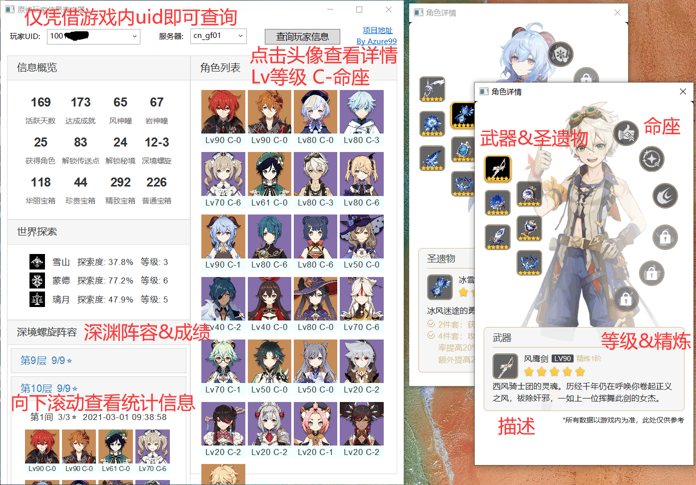
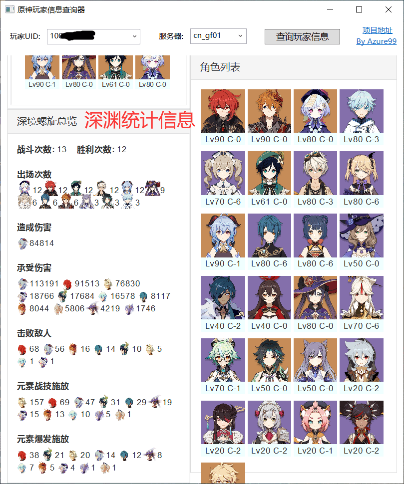

# 原神玩家信息查询器
仅依据**游戏右下角的uid**(而非米游社名片)查询玩家信息 (**自己与其他玩家均可**), 包括但不限于**基础信息**、**角色详情**&**命座**&**装备**、**深境螺旋战绩**&**阵容**&**统计信息**等数据

[立即下载](https://github.com/Azure99/GenshinPlayerQuery/releases) [官网地址](https://www.rainng.com/genshin-player-query/) [问题反馈](https://github.com/Azure99/GenshinPlayerQuery/issues)

## 特性

- 玩家信息: 活跃天数, 成就, 收集数, 世界探索进度等
- 角色列表: 所有角色等级与命座, 点击头像可查看角色详情
- 角色详情: 武器&圣遗物(包括等级和精炼), 命座
- 深渊阵容: 每层深渊阵容(角色等级&命座), 星数, 通关时间
- 深渊统计: 战斗/胜利次数、角色出场次数、造成伤害、承受伤害、击败敌人等

## 效果图

